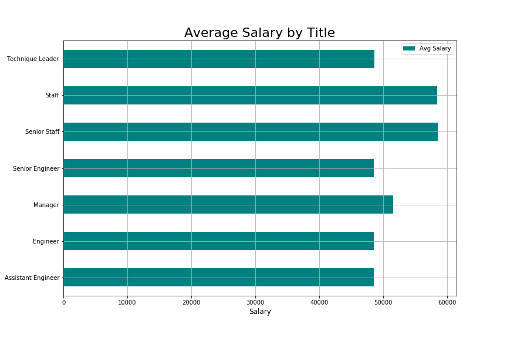

# Employee Database & Analysis

## Project Overview
The goal of this project was to create a database shema and import data from the six .csv files provided of employee and department data.  Once created, a series of queries were preformed to analyze the employee data.

## Database Design
The employees and departments files provided already had unique identifiers defined in the data (employee number and department number).  When creating the corresponding employees and departments tables in the database, I used those identifiers as the primary key of the table.

The remaining tables all had reference to the employees and/or departments by the unique identifiers and they all included a "from" and "to" date.  This would imply multiple records possible for each unique employee and/or department combination so for all remaining tables I defined new primary key as a SERIAL or auto-generated value by the database.  

Note: as a result of those new serial primary keys, I had to exclude those primary key columns during the import process.

## Analysis Performed
The following queries were performed as part of the analysis:
* List details of each employee
* List employees hired in 1986
* List manager of each department
    * NOTE: some departments have had multiple managers. These departments will be repeated for each manager.
* List department of each employee
  * NOTE: some employees have been in multiple departments. These employees will be repeated for each dept.
* List each employee named "Hercules" with a last name beginning with "B"
* List all employees in the Sales department
* List all employees in the Sales and Development departments
* List frequency of employee last name

## Data Visualization
Following up on a hunch that this data set may be fake, I performed a data visualization to chart average salary of employees by title.  To do so, I performed the following:

1. Created a jupyter notebook file for analysis
2. Created a connection to the employee_db database I created in PostgreSQL
3. Pulled salary aggregated data by title from database
4. Created a bar chart of average salary by title

## Project Contents
* schema.png - image of the database schema
* schema.sql - script used to create the database
* queries.sql - sql queries used to perform analysis
* employee_db.ipynb - jupyter notebook file for visualization
* data - folder containing source data
* images - folder contains data viz images

